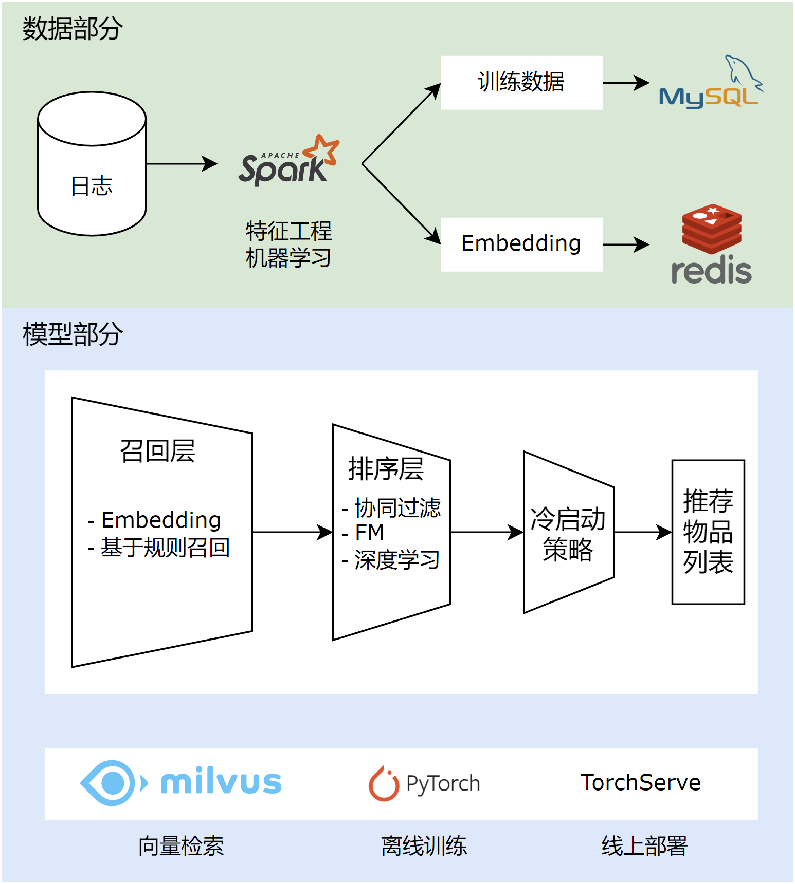

# 喜文乐荐

本项目是一个基于深度学习的书籍推荐系统，可以根据用户的行为进行个性化的推荐。前端采用 Vue 进行渲染，后端采用微服务架构，基于 Spring Cloud 进行搭建，推荐系统采用召回-排序架构，使用 Spark 对特征进行离线处理，生成召回向量，并存入 Redis 中，通过 Milvus 进行向量检索，使用 Pytorch 训练 NeuralCF 等排序模型，并部署在 Torchserve 上进行在线推理

## 技术选型

|     技术      |         说明         |
| :-----------: | :------------------: |
|      Vue      |       前端框架       |
| Spring Cloud  |      微服务框架      |
|  Spring Boot  |   容器 + MVC 框架    |
|   MapStruct   |     Bean 转换器      |
|     Nacos     |     服务注册中心     |
|    MyBatis    |       ORM 框架       |
|     Druid     |     数据库连接池     |
|  PageHelper   | MyBatis 物理分页插件 |
| Elasticsearch |       搜索引擎       |
|    Pytorch    |     深度学习框架     |
|     Spark     |     离线计算框架     |
|     MySQL     |        数据库        |
|     Redis     |       缓存特征       |
|    Milvus     |      向量数据库      |

## 架构

## 推荐系统架构

## 部署

- [前端部署](https://github.com/yj8023xx/xiwenlejian/blob/main/front-end/xiwenlejian/README.md)
- [数据预处理](https://github.com/yj8023xx/xiwenlejian/blob/main/data/README.md)
- [数据库部署](https://github.com/yj8023xx/xiwenlejian/blob/main/sql/README.md)
- [ElasticSearch 部署](https://github.com/yj8023xx/xiwenlejian/blob/main/elasticsearch/README.md)
- [模型训练与部署](https://github.com/yj8023xx/xiwenlejian/blob/main/model/README.md)
- [Milvus 部署](https://github.com/yj8023xx/xiwenlejian/blob/main/milvus/README.md)

## 展示

- 首页

- 搜索页面

- 书籍详情页

- 用户主页

