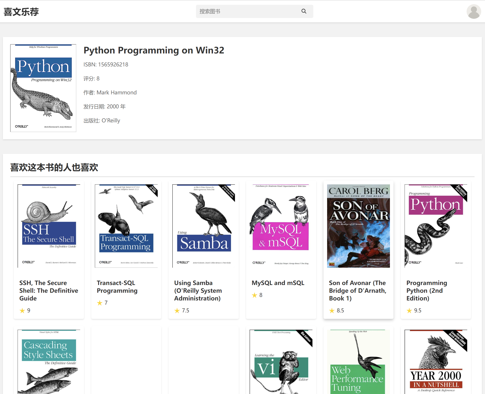

# 喜文乐荐

项目正在完善中，敬请期待！

## 技术选型

|     技术      |         说明         |
| :-----------: | :------------------: |
|      Vue      |       前端框架       |
| Spring Cloud  |      微服务框架      |
|  Spring Boot  |   容器 + MVC 框架    |
|     Nacos     |     服务注册中心     |
|    MyBatis    |       ORM 框架       |
|  PageHelper   | MyBatis 物理分页插件 |
| Elasticsearch |       搜索引擎       |
|    Pytorch    |     深度学习框架     |
|     Spark     |     离线计算框架     |
|     Redis     |       特征缓存       |

## 展示

**首页**

**搜索**

**相似书籍**

**猜你喜欢**

